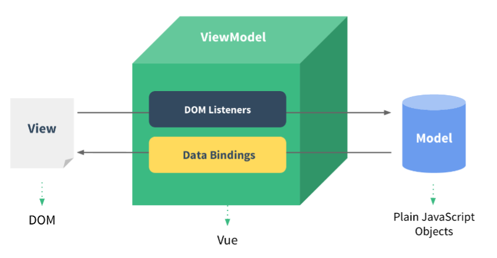

# Vue.js 

## 참고 링크 
- [Vue 공식문서](https://vuejs.org/v2/guide/)
- [Vue 스타일 가이드](https://vuejs.org/v2/style-guide/)
- [Vue Cookbook](https://vuejs.org/v2/cookbook/)
- [Vuex](https://vuex.vuejs.org/)
- [Vue Router](https://router.vuejs.org/)
- [Vue CLI](https://cli.vuejs.org/)

## 목차
- [개요](#개요)
- [특징](#특징)
- [JSP와 Vue비교](#jsp와-vue비교)
- [생명주기(Lifecycle)](#생명주기Lifecycle)
- [인스턴스](#인스턴스) 
- [컴포넌트](#컴포넌트)
- [템플릿 문법](#템플릿-문법)
- [컴포넌트 통신](#컴포넌트-통신)
- [HTTP 통신 라이브러리(axios)](#HTTP-통신-라이브러리(axios))
- [라우터(router)](#라우터-router)
- [Vue CLI](#vue-cli)

# [개요](#Vue.js)
웹페이지 화면을 개발하기 위한 SPA 자바스크립트 프레임워크

`Reactivity`  
- Vue.js가 추구하는 가장 중심사상이자 핵심기능  
- 데이터의 대한 변화를 vue에서 감지해서 화면에 반영  
- 화면 조작에 대한 api, 속성을 vue에서 제공

`Vue의 웹페이지 구성`


`MVVM패턴`  
MVVM패턴의 뷰모델(ViewModel)레이어에 해당하는 화면 단 라이브러리



| 용어 | 설명 
| ---  | --- 
| `View` | 사용자에게 보이는 화면 
| `DOM` | HTML문서에 들어가는 요소(태그, 클래스, 속성)의 정보를 담고있는 데이터 트리
| `DOM Listener` | DOM의 변경 내역에 대해 즉각적으로 반응하여 특정 로직을 수행하는 장치 
| `Model` | 서버에서 가져온 데이터를 자바스크립트 객체 형태로 저장 
| `Data Binding` | 뷰에 표시되는 내용과 모델의 데이터를 동기화 
| `ViewModel` | 뷰와 모델의 중간 영역. 돔 리스너와 데이터 바인딩을 제공


# [특징](#Vue.js)
- 디렉티브를 이용한 `데이터 바인딩`과 화면단위를 반응적이고 조합가능한 `컴포넌트`형태로 제공한다.
- Angular의 `양방향 데이터 바인딩`을 동일하게 제공한다.
- React의 `가상돔(Virtual DOM)`을 이용한 렌더링 방식을 동일하게 제공한다. 
- 컴포넌트간 기본 통신은 `단방향 데이터 흐름(상위 -> 하위)`을 원칙으로 한다.
- 전역 상태관리`vuex`, 화면전환`router`, http통신(비동기)`axios`를 제공한다.
- `vue-devtools`을 이용하여 데이터의 상태를 실시간으로 체크하고 디버깅할 수 있다.
- `proxy처리`를 하여 다른 네트워크 서비스에 간접적으로 접속할 수 있다.
- 싱글 페이지 애플리케이션(`SPA`)이다.  
  - 애플리케이션에 필요한 모든 정적 리소스를 최초에 한번 다운로드한다.
  - 새로운 페이지 요청시 페이지 갱신에 필요한 데이터만 전달 받아 부분 갱신한다.
  - 페이지 새로고침이 발생하지 않으므로 네이티브 앱과 유사한 사용자 경험을 제공한다.
  - 최종 빌드된 파일을 배포하면 파일 용량이 매우 줄어든다.

[다른 프레임워크 비교](https://kr.vuejs.org/v2/guide/comparison.html)
  


# [JSP와 Vue비교](#Vue.js)

## DOM 제어 
`jsp`  
요소, 아이디, 클래스 등의 이름을 document나 jquery의 $()로 선택 후 제어한다.

`Vue`  
v-on, v-bind, ref 등의 vue의 특수한 디렉티브를 사용하여 제어한다.

--------------------
## 파일과 작업영역 구성
`jsp`  
백엔드, 프론트엔드가 혼용된 스파게티 코드  
html(jsp), js, css파일로 분리하거나 body태그 안에 script나 jstl를 사용한다.

`Vue`  
프론트엔드
하나의 컴포넌트(.vue)에 templete, script, style로 나눠서 작업한다.   

--------------------
## 재사용성
`jsp`  
```html
<%@ include file="/WEB-INF/jsp/common/header.jsp"%> 
```
`Vue`  
```html
<Header />
```

--------------------
## 화면 전환(전체, 부분) / 상태관리, 반응성
`jsp`  
새로고침, ajax
- 화면 전체를 다시 렌더링하므로 속도면에서 비효율적이다.

`Vue`  
router, vuex(Store)

- `가상돔(Virtual DOM)`을 이용한 렌더링
  - DOM에서 전체화면을 렌더링하지 않고 변경이 발생되는 부분만 다시 랜더링하기 때문에 DOM 조작 수를 최소화시킨다.
- 상태관리, 반응성(Reactivity)
  - 여러 컴포넌트간의 데이터 전달과 이벤트 통신을 한 곳에서 관리하는 패턴   
  - 변수의 값이 변했을 때 감지하고 곧바로 반응 
 
--------------------
## 비동기 데이터 처리
`jsp`  
ajax, XMLHttpRequest

`Vue`  
axios

--------------------
## 태그에 제어문/변수 적용

c:forEach -> v-for  
c:choose -> 사용 x  
c:when -> v-if, v-show  
c:otherwise -> v-else  
fn:length(배열이름) -> 배열이름.length

`jsp`  
```html
<!-- 변수적용 -->
<div id="data_${index}"></div>

<!-- 반복문 -->
<ul>
<c:forEach items="${list}" var="item">
  <li>{{item}}</li>
</c:forEach>
</ul>

<!-- 요소 추가 -->
<button onclick="add()">추가</button>
<ul class="result"></ul>

<!-- 토글 버튼 -->
<div class="menu">
    <button type="button" class="menu_btn">
        <span>열기</span>
    </button>
</div>

<script>
    var index = 0;
    function add() {
        //jQuery
        var item=`<li data-index="${index}">${++index}</li>`;
        $('.result').append(item);

        //javascript
        document.querySelector('.result').innerHTML += item;
    }

    $('.menu_btn').on('click', function() {
        var text = $('.menu_btn span').text();
        $('.menu_btn span').text(text == "열기" ? "닫기" : "열기");
        $('.menu').toggleClass('on');
    });
</script>
```

`Vue`  
```html
<template>
  <div>
    <!-- 변수 적용 -->
    <div :id="'data_' + index"></div>

    <!-- 반복문 -->
    <ul>
      <li v-for="item in list">{{item}}</li>
    </ul>
    
    <!-- 요소 추가 -->
    <button @click="add">추가</button>
    <ul>
        <li v-for="item in list" :key="item" :data-index="item - 1">>{{item}}</li>
    </ul>
    
    <!-- 토글버튼 -->
    <div :class="'menu'+[onMenu ? ' on' : '']">
        <button type="button" class="menu_btn" @click="onMenu = !onMenu">
            {{onMenu ? '닫기' : '열기' }}
        </button>
    </div>>
  </div>
</template>

<script>
export default {
    data() {
        return {
            list:[],
            index:0, 
            onMenu:false
        }
    },
    methods: {
        add(){
            this.list.push(++this.index);
        }
    },
}
</script>
```


# [생명주기(Lifecycle)](#Vue.js)
<!--  -->

- 인스턴스 생성(create)  
- 인스턴스 부착(mount)   
- 인스턴스 갱신(update)  
- 인스턴스 제거(destroy)     

| 속성 | 설명 |
| ---  | --- |
| beforeCreate | 인스턴스가 생성되고 나서 가장 처음으로 실행되는 라이프 사이클 단계이다. 이 단계에서는 data 속성과 methods 속성이 아직 인스턴스에 정의되어 있지 않고, 돔과 같은 화면 요소에도 접근할 수 없다 
| `*created` | data 속성과 methods 속성이 정의되었기 때문에 this.data 또는 this.fetchData()와 같은 로직들을 이용하여 data 속성과 methods 속성에 정의된 값에 접근하여 로직을 실행할 수 있다. 다만, 아직 인스턴스가 화면 요소에 부착되기 이전이기 때문에 template 속성에 정의된 돔 요소로 접근할 수 없다. data 속성과 methods 속성에 접근할 수 있는 가장 첫 라이프 사이클 단계이자 컴포넌트가 생성되고 나서 실행되는 단계이기 때문에 `서버에 데이터를 요청하여 받아오는 로직을 수행`하기 좋다. 
| beforeMount | template 속성에 지정한 마크업 속성을 `render()` 함수로 변환한 후 el 속성에 지정한 특정 화면 요소에 인스턴스를 부착하기 전에 호출되는 단계이다. render()가 호출되기 이전에 로직을 추가하기 좋다. 
| `*mounted` | el 속성에서 지정한 화면 요소에 인스턴스가 부착되고 나면 호출되는 단계로, template 속성에 정의한 `화면 요소에 접근`할 수 있어 화면 요소를 제어하는 로직을 수행하기 좋은 단계이다. 다만, 돔에 인스턴스가 부착되자마자 바로 호출되기 때문에 하위 컴포넌트나 외부 라이브러리에 의해 추가된 화면 요소들이 최종 HTML 코드로 변환되는 시점과 다를 수 있다. 변환되는 시점이 다를 경우 $nextTick() API를 이용하여 HTML 코드로 최종 파싱될 때까지 기다린 후 돔 제어 로직을 추가한다. 
| beforeUpdate | el 속성에서 지정한 화면 요소에 인스턴스가 부착되고 나면 인스턴스에 정의한 속성들이 화면에 치환된다. 치환된 값은 뷰의 반응성을 제공하기 위해 $watch 속성으로 감시한다. 또한 beforeUpdate는 관찰하고 있는 데이터가 변경되면 가상 돔으로 화면을 다시 그리기 전에 호출되는 단계이며, 변경 예정인 새 데이터에 접근할 수 있어 변경 예정 데이터의 값과 관련된 로직을 미리 넣을 수 있다. 
| updated | 데이터가 변경되고 나서 가상 돔으로 다시 화면을 그리고 나면 실행되는 단계이다. 데이터 변경으로 인한 화면 요소 변경까지 완료된 시점이므로, 데이터 변경 후 화면 요소 제어와 관련된 로직을 추가하기 좋은 단계이다. 이 단계에서 데이터 값을 변경하면 무한 루프에 빠질 수 있기 때문에 값을 변경하려면 computed, watch 와 같은 속성을 사용해야 한다. 따라서 데이터 값을 갱신하는 로직은 가급적이면 beforeUpdate에 추가하고, updated에서는 변경 데이터의 화면 요소와 관련된 로직을 추가하는 것이 좋다.
| beforeDestroy | 뷰 인스턴스가 파괴되기 직전에 호출되는 단계이다. 이 단계에서는 아직 인스턴스에 접근할 수 있다. 따라서 뷰 인스턴스의 데이터를 삭제하기 좋은 단계이다.
| destroyed | 뷰 인스턴스가 파괴되고 나서 호출되는 단계이다. 뷰 인스턴스에 정의한 모든 속성이 제거되고 하위에 선언한 인스턴스들 또한 모두 제거된다.

* `render()` : 자바스크립트로 화면의 돔을 그리는 함수


# [인스턴스](#Vue.js)
필수로 생성해야하는 단위이며 인스턴스안에 여러가지 내용을 추가할 수 있다.

`templete`
```html
<template>
    <div class="container">
        {{message}}
    </div>
</template>
```
`javscript`
```js
export default {
    // 자식 컴포넌트를 연결해서 사용할 경우
    components: {},
    // 부모의 속성을 전달 받을 경우
    props:[],
    // 데이터 속성 설정
    data() {
        return {
            message:'hi'
        }
    },
    //계산된 속성값이 필요할 때
    computed: {
        
    },
    // 데이터를 관찰할 때
    watch: {
        
    },
    // 인스턴스가 생성된 후 해야할 일, 데이터 초기화 
    created() {
        
    },
    // 요소가 생성된 후 해야할 일 (템플릿, 컴포넌트, DOM접근 가능)
    mounted(){
        
    },
    // 기능 구현
    methods: {
        
    },
    //기타 lifecycle 호출
}
```
`css`
```css
<style>
    .container{
        width:800px;
    }
</style>
```

## 계산형 속성 computed 
메서드처럼 보이지만 속성처럼 사용하며 순수 값을 변형하여 사용할 때 유용하다.  
{{result}} => result 값을 적용시 계산이 필요하다면 computed로 처리 후 속성 이름만 적용해야한다.

`bad - 템플릿 리터럴에 바로 적용`
```javascript
{{
  fullName.split(' ').map(function (word) {
    return word[0].toUpperCase() + word.slice(1)
  }).join(' ')
}}
```
`good - computed로 적용`
```javascript
{{ normalizedFullName }}

computed: {
  normalizedFullName: function () {
    return this.fullName.split(' ').map(function (word) {
      return word[0].toUpperCase() + word.slice(1)
    }).join(' ')
  }
}
```


# [컴포넌트](#Vue.js)
화면의 영역을 구분해서 개발하는 방식  
UI는 컴포넌트 기반으로 개발하며 이는 코드의 재사용관점에서 유용하다.

vue-cli로 프로젝트를 생성하면 vue파일을 만들어서 파일별로 컴포넌트를 관리할 수 있다.

`전역 컴포넌트`
```javascript
Vue.component('some-comp', {
  data: function () {
    return {
      foo: 'bar'
    }
  }
})
```
`지역 컴포넌트`
```javascript
new Vue({
  data: {
    foo: 'bar'
  }
})
```
`.vue 파일(싱글 파일 컴포넌트)`
```javascript
export default {
  data () {
    return {
      foo: 'bar'
    }
  }
}
```


# [템플릿 문법](#Vue.js)
화면 조작 
- 데이터 바인딩 : reactivity방식
- 뷰 디렉티브 : v-on, v-if, v-model ...
  - v-on 은 @로 대체 가능 ex)v-on:click => @click
  - v-bind는 :로 대체 가능 ex)v-bind:propsdata => :propsdata


# [컴포넌트 통신](#Vue.js)
데이터의 흐름을 제어하기 위한 규칙을 제한
- props(상위에서 하위로) : 특정 컴포넌트에서만 사용되는 고유 속성 
- event emit(하위에서 상위로) : 특정 컴포넌트에서만 사용되는 고유 이벤트

## props name 규칙
props에서 카멜케이스로 작성했다면 html에서는 대소문자 구분이 없으므로 케밥케이스로 작성해야한다.
```html
<WelcomeMessage :greeting-text1="hi" :greetingtext2="hi"/>

<script>  
export default {
  props: {
    greetingText1: String,
    greetingtext2: String
  }
}
</script>

```

## 같은 레벨 컴포넌트 간의 데이터 공유 


`*같은 레벨 컴포넌트간의 직접적인 통신은 불가능하다.`

1. appContent컴포넌트에서 클릭 이벤트 발생하면 passNum()메소드 실행 
2. emit으로 pass이벤트와 10을 부모컴포넌트로 전달 
3. 부모쪽에서는 appContent컴포넌트에서 pass라는 이벤트가 감지되면 getNum()메소드 실행
4. getNum메소드는 전달받은 숫자를 data의 num에 적용 
5. appHeader컴포넌트는 getNum이라는 props속성에 num변수를 적용하였으므로
   템플릿 문법 중 {{}}으로 변경된 값을 적용한다.

```html
    <div id="app">
        <app-header :getNum="num"></app-header>
        <app-content @pass="get-num"></app-content>
    </div>
    <script>
        var appHeader = {
            template: '<div>header{{getNum}}</div>',
            props: ['getNum']
        }
        var appContent = {
            template: '<div>content <button @click="passNum">pass</button></div>',
            methods: {
                passNum: function() {
                    this.$emit('pass', 10)
                }
            },
        }
        new Vue({
            el: '#app',
            components: {
                appHeader,
                appContent
            },
            data: {
                num: 0
            },
            methods: {
                getNum: function(num) {
                    this.num = num;
                }
            },
        })
    </script>
```

## 데이터 흐름 제어 예제
`App.vue`
```html
<template>
  <div>
    <app-header :propdata="str" @renew="renewString"></app-header>
  </div>
</template>

<script>
import AppHeader from './components/AppHeader';
export default {
  name:'App',
  components:{ AppHeader },
  // components:{
  //   'app-header':AppHeader
  // },
  data: function () {
    return {
      str: 'Header'
    }
  },
  methods: {
    renewString:function(str){      
      this.str=str;    
    }
  },
}
</script>
```
`AppHeader.vue`

```html
<template>
  <div>
      <h1>{{propdata}}</h1>
      <button @click="sendEvent">send</button>
  </div>
</template>

<script>
export default {
    props:['propdata'],
    methods: {
        sendEvent:function(){
            this.$emit('renew','change');
        }
    },
}
</script>
```


# [HTTP 통신 라이브러리(axios)](#Vue.js)

`Promise based HTTP client for the browser and node.js`

Promise 기반으로 만들어진 브라우저 및 node.js를 위한 HTTP 클라이언트 라이브러리로써, 비동기 방식으로 HTTP 데이터 요청을 실행한다.  
복잡한 XMLHttpRequest를 다루지 않고 AJAX 호출을 할 수 있다.

## 주요 메서드 
- axios.request(config)
- axios.get(url[, config])
- axios.delete(url[, config])
- axios.head(url[, config])
- axios.options(url[, config])
- axios.post(url[, data[, config]])
- axios.put(url[, data[, config]])
- axios.patch(url[, data[, config]])

## axios 라이브러리 설치
> npm i axios

## axios 예제
`FormApp.vue`
```html
<template>
  <div>
    <h3>등록</h3>
    <form @submit.prevent="submitForm">
          <div>
              <label for="username">id</label>
              <input type="text" id="username" v-model="username">
          </div>
          <div>
              <label for="password">password</label>
              <input type="password" id="password" v-model="password">
          </div>
          <button type="submit">login</button>
    </form>
   
    <h3>조회</h3>
    <input type="text" v-model="id">
    <button @click="getUser">조회</button>
    <ul class="result" v-show="result">
      <li>id:{{result.id}}</li>
      <li>name:{{result.name}}</li>
      <li>username:{{result.username}}</li>
    </ul>
  </div>
</template>

<script>
import axios from 'axios';
export default {
  name:'formApp',
  data:function () {
    return {
      username:'',
      password:'',
      id:'',
      result:'',
    }
  },
  methods: {
    submitForm:function(){
      // e.preventDefault();      
      var url='https://jsonplaceholder.typicode.com/users';
      var data={
        username:this.username,
        password:this.password
      }      
      axios.post(url, data)
      .then((res)=>{
        console.log(res);        
      })
      .catch((err)=>{
        console.log(err);        
      });
    },
    getUser:function(){
      // 화살표 함수를 적용하지 않을 때는  // var vm = this;로 접근
      // 화살표 함수로 적용시       
      axios.get('https://jsonplaceholder.typicode.com/users?id='+this.id)
      .then(res => {
        console.log(res.data[0]);
        //vm.result=res.data[0];
        this.result=res.data[0];  
      })
      .catch((err)=>{
        console.log(err);        
      });
    }
    
  },
}
</script>
```


# [라우터 (router)](#vue.js)
뷰(화면) 전환
```html
    <script src="https://cdn.jsdelivr.net/npm/vue/dist/vue.js"></script>
    <script src="https://unpkg.com/vue-router/dist/vue-router.js"></script>
    <div id="app">
        <div>
            <router-link to="/login">login</router-link>
            <router-link to="/main">main</router-link>
        </div>
        <router-view></router-view>
    </div>
    <script>
        var LoginComponent = {
            template: '<div>login page</div>'
        }
        var MainComponent = {
                template: '<div>main page</div>'
            }
            //라우터 인스턴스 생성
        const router = new VueRouter({
            // url의 #값을 제거
            mode: 'history',
            //페이지의 라우팅 정보
            routes: [{
                //페이지의 url이름
                path: '/login',
                component: LoginComponent
            }, {
                path: '/main',
                component: MainComponent
            }]
        })

        new Vue({
            el: '#app',
            components: {
                LoginComponent,
                MainComponent
            },
            //라우터 등록
            router: router,
            data: {

            }
        })
    </script>
```


# [Vue CLI](#vue.js)

커멘드 라인 인터페이스 기반의 Vue 프로젝트 생성 도구 

`vue-cli 라이브러리 설치(전역)`
> npm i @vue/cli -g