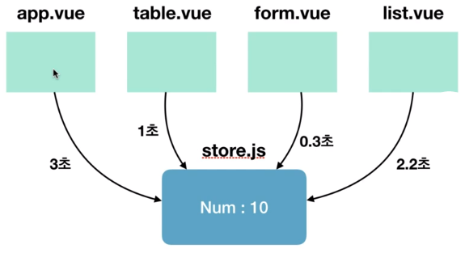

# Vuex(Store) 

## 목차
- [Vuex개요](#vuex개요)
- [Flux 패턴 소개](#Flux-패턴-소개)
- [Vuex 컨셉과 구조](#Vuex-컨셉과-구조)
- [Vuex 설치 및 시작](#Vuex-설치-및-시작)
- [Vuex 기술요소](#Vuex-기술요소)
- [Vuex Helpers](#Vuex-Helpers)
- [Vuex로 구조화 및 모듈화하는 방법](#Vuex로-구조화-및-모듈화하는-방법)

# [`Vuex개요`](#vuexstore)
- 무수히 많은 컴포넌트의 데이터를 관리하기 위한 상태 관리 패턴이자 라이브러리
- Vuex 라이브러리의 등장 배경인 Flux패턴 
- 주요 속성 state, getters, mutations, actions   
[vuex 참고](https://steemit.com/kr/@stepanowon/vuex)  

# [`Flux 패턴 소개`](#vuexstore) 
MVC패턴의 복잡한 데이터 흐름 문제를 해결하는 개발 패턴이다.   
단방향 데이터 흐름(Unidirectional data flow)을 가지고 있다.    
- 부모 -> props -> 자식  
- 자식 -> emit -> 부모

## 1.Flux패턴

데이터의 흐름이 여러갈래로 나뉘지 않고 단방향으로만 처리되는 패턴
```
Action -> Dispatcher -> Model(Store) -> View -> Action ...
```
1. action : 화면에서 발생하는 이벤트 또는 사용자의 입력
2. dispatcher : 데이터를 변경하는 방법, 메서드
3. model : 화면에 표시할 데이터
4. view : 사용자에게 비춰지는 화면

## 2.Vuex가 필요한 이유

복잡한 애플리케이션에서 컴포넌트의 개수가 많아지면 컴포넌트 간에 데이터 전달이 어려워진다.  
즉 props나 이벤트로 계속 전달을 해주어야 한다.

ex)로그인 처리  
```
a 로그인 폼 -> b 로그인 -> c 기타처리 -> d 기타처리 -> e 루트 -> f 메인   
```
a컴포넌트에서 f컴포넌트로 가기위해 여러번 걸쳐야하는 번거로움이 발생

`이벤트버스를 사용하면?`
- 컴포넌트간 데이터 전달이 명시적이지 않음
- 어디서 이벤트를 보냈는지 혹은 어디서 이벤트를 받았는지 알기 어려움

```javascript
//Login.vue
eventBus.$emit('fatch',loginInfo)
//List.vue
eventBus.$on('display',data => this.displayOnScreen(data))
//Chart.vue 
eventBus.$emit('refreshData',chartData)
```

`Vuex로 해결할 수 있는 것`
1. MVC패턴에서 발생하는 구조적 오류
2. 컴포넌트 간 데이터 전달 명시
3. 여러개의 컴포넌트에서 같은 데이터를 업데이트 할 때 동기화 문제

# [`Vuex 컨셉과 구조`](#vuexstore)
- State : 컴포넌트 간에 공유하는 `data`
- View : 데이터를 표시하는 화면 `template` 
- Actions : 사용자의 입력에 따라 데이터를 변경하는 `methods`
  
**`Vuex의 단방향 데이터 흐름 처리`**


**`Vuex 구조`**


1. 컴포넌트(.vue)에서 이벤트(액션)가 발생한다.
2. 이벤트가 발생되면 dispatch로 비동기 데이터 처리를 위한 actions에 접근한다.
3. actions에서 데이터 처리를 한 후 commit으로 동기 처리를 위한 muations에 접근한다.   
4. muations에서 state값을 변경하기 위한 로직을 수행한다.
5. state값이 최종 변경되면 화면을 랜더링한다. 
6. 다시 1번으로 돌아간다.


***
# [`Vuex 설치 및 시작`](#vuexstore)

## 1.설치
> npm install vuex --save


## 2.시작
src폴더에 store/store.js 생성
```js
import Vue from 'vue'
import Vuex from 'vuex'

Vue.use(Vuex);

export const store = new Vuex.Store({
  state:{},
  getters:{},
  mutations:{},
  actions:{}
})
```


# [`Vuex 기술요소`](#vuexstore)
## Store 객체의 주요 요소
| 요소           | 설명                                      |           방식 |
| ------------- | --------------------------------------- | -----------: |
| `state`       | 여러 컴포넌트에 공유되는 데이터 |         data |
| `getters`     | 연산된 state값을 접근하는 속성 |     computed |
| `mutations`   | state값을 변경하는 로직을 선언 |       method |
| `actions`     | 비동기 처리 로직(api 통신)을 선언 | aysnc method |
| `commit`      | 변이(mutations) 호출 |       method |
| `dispatch`    | 액션(actions) 호출 (한 액션에서 다른 액션을 호출할 수 있다) |       method |

<!-- | `rootGetters` | 루트 저장소의 게터 |       computed |
| `rootState`   | 루트 저장소의 상태 데이터 |       data |
-->


## 1.state

데이터 구분 
- vuex state data
  - 서버에서 데이터를 받아오는 중인지 나타내는 논리값 
  - 로그인한 사용자 정보 등 전체 애플리케이션에서 사용하는 데이터
  - 상품정보처럼 애플리케이션 여러 곳에서 사용도리 가능성이 있는 데이터

- component data
  - 마우스 포인터가 올라간 요소를 나타내는 논리값
  - 드래그로 끌어온 요소의 좌표
  - 입력 중인 폼의 입력값

```js
// Vue
data:{
  message:'hi'
}
// Vuex
state:{
  message:'hi'
}
```

```html
<!-- Vue -->
<p>{{message}}</p>
<!-- Vuex -->
<p>{{this.$store.state.message}}</p>
```

## 2.getters
`store.js`
```js
state:{
  num:10
},
getters:{
  getNumber(state){
    return state.num;
  },
  doubleNumber(){
    return state.num*2;
  }
}
```

```html
<p>{{this.$store.getters.getNumber}}</p>
<p>{{this.$store.getters.doubleNumber}}</p>
```

## 3.mutations(동기 처리 로직)
- 기존 vue에서 methods에 넣었던 코드에 해당됨
- state값을 변경할 수 있는 유일한 방법
- commit(메서드명, 전달할 데이터)으로 동작한다.  
- state를 변경하기 위해 mutations를 동작시킬 때 인자(payload)를 전달할 수 있음
- devTools에서 state값을 추적할 수 있다.
  
`store.js`
```js
state:{num:10},
mutations:{
  printNumbers(state){
    return state.num
  },
  sumNumbers(state, anotherNum){
    return state.num+anotherNum
  },
  modifyNumbers(state, payload){
    console.log(payload.str);    
    return state.num+=payload.num;
  }
}
```
`App.vue`
```js
this.$store.commit('printNumbers');
this.$store.commit('sumNumbers', 20);
this.$store.commit('modifyNumbers', {
  str:'메세지',
  num:20
});
```

`state는 왜 직접 변경하지 않고 mutations로 변경할까?`
- 여러개의 컴포넌트에서 state값을 직접적으로 변경한다면 어느 컴포넌트에서 해당 state를 변경했는지 추적하기 어렵다.
- 특정 시점에 어떤 컴포넌트가 state를 직접 접근하여 변경한 건지 확인하기 어렵기 때문
- 따라서 뷰의 반응성을 거스르지 않게 명시적으로 상태 변화를 수행. 반응성, 디버깅, 테스팅

## 4.actions(비동기 처리 로직)
- 비동기 처리 로직을 선언하는 메서드. 비동기 로직을 담당하는 mutations
- 데이터요청, Promise, ES6 async와 같은 비동기 처리는 모두 actions에 선언
  


`왜 비동기 처리 로직은 actions에 선언해야 할까?`
- 언제 어느 컴포넌트에서 해당 state를 호출하고 변경했는지 확인하기가 어려움
- state값의 변화를 추적하기 어렵기 때문에 mutations속성에는 동기 처리 로직만 넣는다.
- actions에서 비동기 처리를 한 후 안전하게 mutations으로 동기 처리한다.


`비동기 데이터 실행 후 state 변경하는 순서`  
1. App.vue -> dispatch('delayDoubleNumber')발생
2. store.js -> actions의 delayDoubleNumber실행 commit('doubleNumber')발생
3. store.js -> mutaions의  doubleNumber실행 state 변경
```js
//store.js
state:{num:10},
mutations:{
  doubleNumber(state){
    state.num*2;
  }
},
actions:{
  //context로 store의 메서드(mutations)와 속성 접근
  delayDoubleNumber(context){    
    //commit() : mutations발생
    context.commit('doubleNumber')
  },
  // 위의 메서드를 축약시
  delayDoubleNumber({commit}){
    // 전달인자 분해 문법 context.commit=={commit}
    commit('doubleNumber')
  }
}
//App.vue
//dispatch() : actions발생
this.$store.dispatch('delayDoubleNumber');
```

`api 적용 예제`
```js
//store.js
state:{product:{}},
mutations:{
  setData(state, fetchedData){
    state.product=fetchedData;
  }
},
actions:{
  fetchProductData(context){
    return axios.get('https://domain.com/products/1')
          .then(response => context.commit('setData', response))    
  }
}
//App.vue
methods:{
  getProduct(){
    this.$store.dispatch('fetchProductData');
  }
}
```

# [`Vuex Helpers`](#vuexstore)
  
Store에 있는 4가지 속성들을 간편하게 코딩하는 방법

| `속성`      | `Helper함수`   |
| --------- | ------------ |
| state     | mapState     |
| getters   | mapGetters   |
| mutations | mapMutations |
| actions   | mapActions   |

## 1.mpaState

```js
//store.js
state:{
  num:10
}

//App.vue
import { mapState } from "vuex";

computed:{
  ...mapState(['num'])
  // num(){
  //   return this.$store.state.num;
  // }
}
```
```html
<!-- <p>{{this.$store.state.num}}</p> -->
<p>{{num}}</p>
```

## 2.mapGetters
```js
//store.js
state:{
  msg:'hello'
},
getters:{
  reverseMessage(state){
    return state.msg.split('').reverse().join('');
  }
}

//App.vue
import { mapGetters } from "vuex";

computed(){
  ...mapGetters(['reverseMessage'])
  // 사용할 이름을 지정하고 싶을 때
  // ...mapGetters({
  //   reverseMsg:'reverseMessage'}
  // )
  // 기존방식
  // reverseMsg(){
  //   return this.$store.getters.reverseMessage;
  // }
}
```
```html
<!-- <p>{{this.$store.getters.reverseMsg}}</p> -->
<!-- <p>{{reverseMsg}}</p> -->
<p>{{reverseMessage}}</p>
```

## 3.mapMutations
```js
//store.js
state:{
  msg:'hello'
},
mutations:{
  clickBtn(state){
    alert(state.msg)
  }
}

//App.vue
import { mapMutations } from "vuex";

method:{
  ...mapMutations(['clickBtn']),
  otherMethod(){}  
}
```
```html
<button @click="clickBtn">msg</button>
```

## 4.mapActions
```js
//store.js
state:{
  msg:'hello'
},
mutations:{
  clickBtn(state){
    alert(state.msg)
  }
},
actions:{
  delayClickBtn(context){
    setTimeout(() => context.commit('clickBtn'), 2000)
  }
}

//App.vue
import { mapActions } from "vuex";

method:{
  ...mapActions(['delayClickBtn']),
}
```
```html
<button @click="delayClickBtn">msg</button>
```

## 5. 헬퍼의 유연한 문법 
1. Vuex에 선언한 속성을 그대로 컴포넌트에 연결하기
```js
...mapMutations([
  'clickBtn', //'clickBtn':clickBtn
  'addNumber' //addNumber(인자)
])
```

2. Vuex에 선언한 속성을 컴포넌트의 특정 메서드에 연결하기 
```js
...mapMutations({
  popupMsg:'clickBtn' // 컴포넌트 메서드명 : Store 뮤테이션명
})
```

# [`Vuex로 구조화 및 모듈화하는 방법`](#vuexstore)
- import & export를 이용하여 속성별로 모듈화한다.
```js
//store.js
import Vue from 'vue'
import Vuex from 'vuex'
import * as getters from 'store/getters.js'
import * as mutations from 'store/mutations.js'
import * as actions from 'store/actions.js'

export const store = new Vuex.Store({
  state:{},//내부에 작성
  getters:getters,
  mutations,//이름이 같을 경우 한번만 작성
  actions
})
```

- 1개의 store로 관리하기 힘들 때 modules속성을 사용한다.

```js
//store.js
import Vue from 'vue'
import Vuex from 'vuex'
import todo from 'modules/todo.js'
import notice from 'modules/notice.js'

export const store = new Vuex.Store({
  modules:{
    modulesA:todo, //모듈명칭 : 모듈파일명
    todo, // todo:todo => 이름이 같을 경우 한번만 작성
    notice
  }
})

//todo.js
const state={}
const getters={}
const mutations={}
const actions={}

export default{state, getters, mutaions, actions}
```


  
